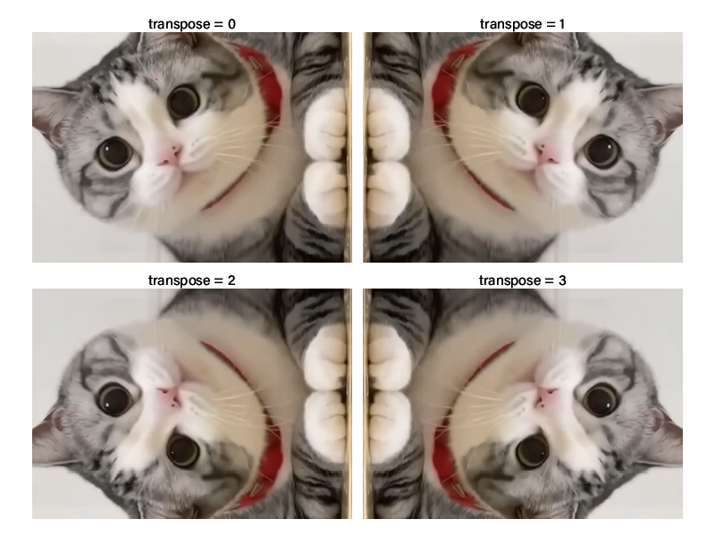
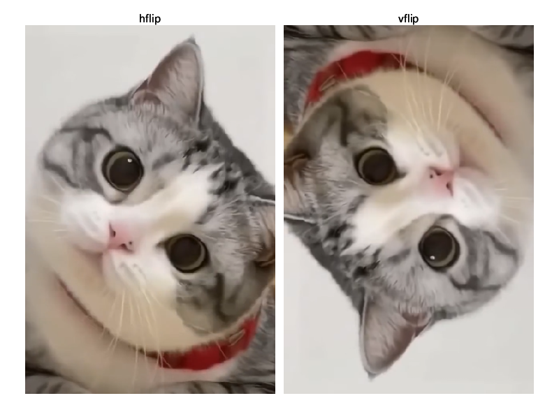

## __FFmpeg__
Консольное приложение, предоставляющее широкий
набор инструментов для обработки мультимедийных файлов: видео,
аудио, изображений, субтитров и их метаданных.

## О проекте
Данный проект представляет собой руководство для пользователя по
вызову часто используемых инструментов FFmpeg:


## Установка и запуск __FFmpeg__
### __Windows__
1. Зайдите на сайт https://github.com/BtbN/FFmpeg-Builds/releases
2. В разделе "Latest Auto-Build (<Дата>)" нажмите на **Assets**,
   чтобы увидеть список сборок. Из них выберите верхнюю:

   ffmpeg-<Версия>-latest-win64-gpl-<Версия>.zip

   Например,

   `ffmpeg-n7.1-latest-win64-gpl-7.1.zip`
3. Распакуйте архив в выбранную папку, например:


    `C:\ffmpeg`

4. Добавьте FFmpeg в переменную среды:
- Откройте средство Windows **Изменение системных переменных среды**.
- В разделе **Системные переменные** найдите переменную **Path** и нажмите **Изменить**.
- Нажмите **Создать** и введите путь к папке `C:\ffmpeg\bin`, затем сохраните изменения.

5. Откройте командную строку (cmd) и введите:
   ```bash
   ffmpeg -version
   ```
   При корректной установке в отобразится:

   `ffmpeg version n7.1-16-g15035aaec0-20241105 Copyright (c) 2000-2024 the FFmpeg developers`

### __Linux__
1. Введите в терминал:
   ```
   sudo apt update && sudo apt install ffmpeg -y
   ```
2. Проверьте успешность установки командой:
   ```
   ffmpeg -version
   ```

## Основные параметры
### Общие
- `-i` – _input_. Путь к обрабатываемому файлу с расширением (mp4, mov и т.д.)
- `-vf` – _video filter_. Фильтры, применяемые к видео.
- `-c:v` – _codec video_. Указывает видеокодек.
- `-c:a` – _codec audio_. Указывает аудиокодек.

### Фильтры для обработки видео
### 1. Поворот (`transpose`)
- `0` – 90° против часовой стрелки с вертикальным отражением (по умолчанию).
- `1` – 90° по часовой стрелке.
- `2` – 90° против часовой стрелки.
- `3` – 90° по часовой стрелке с вертикальным отражением.

Пример использования:
```bash
ffmpeg -i input.mov -vf "transpose=1" output.mov
```

Оригинальное видео:
<div style="text-align: center;">
  
</div>

Результаты поворота видео при различных значениях transpose


### 2. Отражение
- `hflip` – _Horizontal flip_. Горизонтальное (зеркальное) отражение.
- `vflip` – _Vertical flip_. Вертикальное (сверху-вниз) отражение.

Пример использования:
```bash
ffmpeg -i input.mp4 -vf "hflip" output.mp4
```
<div style="text-align: center;">
   
</div>

### 3. Обрезка видео по времени
- ss – начальное время (часы:минуты:секунды).
- t – длительность обрезки (часы:минуты:секунды).
- to – конечное время (часы:минуты:секунды).

Пример использования (начало с 10-й секунды и длительность 30 секунд):
```bash
ffmpeg -i input.mp4 -ss 00:00:10 -t 00:00:30 -c copy output.mp4
```

### 4. Изменение размера видео
- `scale = w:h` (разрешение - ширина:высота)
  w – желаемая ширина видео в px.
  h – желаемая высота видео в px.
- `-1` – при указании этого значения для одного из параметров, FFmpeg автоматически рассчитает второй параметр,
  сохраняя пропорции исходного вида

Пример использования (фиксированные размеры):
```bash
ffmpeg -i input.mp4 -vf "scale=1280:720" output.mp4
```

Пример использования (расчет высоты по ширине):
```bash
ffmpeg -i input.mp4 -vf "scale=1280:-1" output.mp4
```

### 5. Скриншот
- `ss` – время, с которого будет извлечен кадр (часы:минуты:секунды).
- `vframes` - количество кадров.

Пример использования (1 кадр):
```bash
ffmpeg -i input.mp4 -ss 00:00:10 -vframes 1 thumbnail.jpg
```

Пример использования (5 кадров подряд):
```bash
ffmpeg -i input.mp4 -ss 00:00:10 -vframes 5 output_%03d.jpg
```
В данном случае кадры будут сохранены как отдельные файлы output_001.jpg,
output_002.jpg, и так далее
